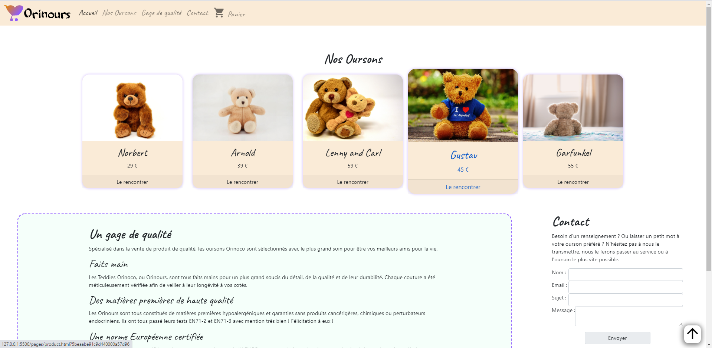

# Welcome on the  Project !
## Backend
### Prerequisites
You will need to have **Node** and **npm** installed locally on your machine.

### Installation
Clone this repo. From within the project folder**/backend**, run **npm install**. You can then run the server with **node server**. The server should run on localhost with default port 3000. If the server runs on another port for any reason, this is printed to the console when the server starts, e.g. Listening on port 3001.

## FrontEnd

I choose to start on the teddies products, but this API is thinked to be scalable.
You can change category in "**change_category.js**" file and writting **"cameras" instead of "teddies"**.
Informations : Only teddies and cameras are implemented, the design is set for teddies for the moment.
I know that it should be a JSON or env file but possibilities were limitates in JS vanilla and without host. I tried to be the most faithful to the JSON format for this change_category.js file. On purpose, the function will be replaced by templating.
Open **/frontend/index.html** and enjoy ;)